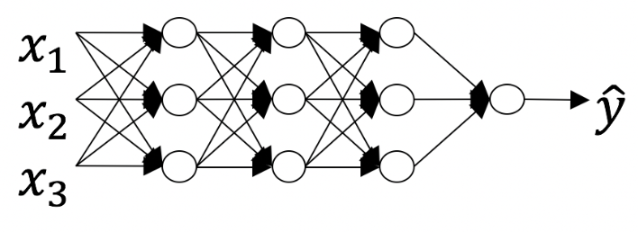
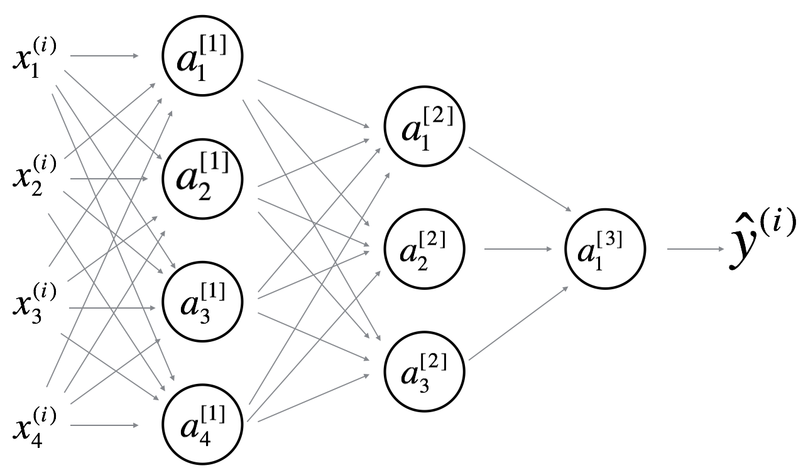

## Week 4 Quiz - Key Concepts on Deep Neural Networks

1. What is the "cache" used for in our implementation of forward propagation and
backward propagation?

    - [ ] It is used to cache the intermediate values of the cost function
      during training.
    - [ ] We use it to pass variables computed during backward propagation to
      the corresponding forward propagation step. It contains useful values for
      forward propagation to compute activations.
    - [ ] It is used to keep track of the hyperparameters that we are searching
      over, to speed up computation.
    - [x] We use it to pass variables computed during forward propagation to the
      corresponding backward propagation step. It contains useful values for
      backward propagation to compute derivatives.

2. Among the following, which ones are "hyperparameters"?

    - [x] Learning rate *alpha*.
    - [x] Size of the hidden layers *n^[l]*.
    - [x] Number of layers *L* in the neural network.
    - [ ] Activation values *a^[l]*.
    - [ ] Bias vectors *b^[l]*.
    - [ ] Weight matrices *W^[l]*.
    - [x] Number of iterations.

3. Which of the following statemets is true?

    - [x] The deeper layers of a neural network are typically computing more
      complex features of the input than the earlier layers.
    - [ ] The earlier layers of neural network are typically computing more
      complex features of the input than the deeper layers.

4. Vectorization allows you to compute forward propagation in a *L*-layer neural
   network without an explicit for-loop over the layers *l**=1,2...L*.

    - [ ] True.
    - [x] False.

5. Assume we store the values for *n^[l]* in an array called *layer_dims = [n_x,
4, 3, 2, 1]*. Which of the following fot-loops will allow you to initialize
the parameters for the model?

    ```python3
    for i in range(1, len(layer_dims)):
        parameter['W' + str(i)] = np.random.randn(layer_dims[i], layer_dims[i-1]) * 0.01
        parameter['b' + str(i)] = np.random.randn(layer_dims[i], 1) * 0.01
    ```

6. Consider the following neural network.

    

    How many layers does this network have?

    The number of layers *L* is 4. The number of hidden layers is 3.

7. During forward propagation, in the forward function for a layer *l* you need
to know what is the activation function in a layer. During backpropagation, the
corresponding backward function also needs to know what is the activation
function for layer *l*, since the gradient depends on it.

    - [x] True.
    - [ ] False.

8. There are certain functions with the following properties:

    (i) To cumpute the function using a shallow neural network circuit, you will
    need a large network (where we measure size by the number of logic gates in
    the network), but (ii) to cumpute it using a deep network circuit, you need
    only an exponentially smaller network.

    - [x] True.
    - [ ] False.

9. Consider the following 2 hidden layer neural network.

    

    Which of the following statemets are true?

    - [x] *W^[1]* will have shape (4, 4).
    - [x] *b^[1]* will have shape (4, 1).
    - [ ] *W^[1]* will have shape (3, 3).
    - [ ] *b^[1]* will have shape (4, 1).
    - [x] *W^[2]* will have shape (3, 4).
    - [ ] *b^[2]* will have shape (1, 1).
    - [ ] *W^[2]* will have shape (3, 1).
    - [x] *b^[2]* will have shape (3, 1).
    - [ ] *W^[3]* will have shape (3, 1).
    - [x] *b^[3]* will have shape (1, 1).
    - [x] *W^[3]* will have shape (1, 3).
    - [ ] *b^[3]* will have shape (3, 1).

10. Whereas the previous question used a specific network, in the general case
what is the dimension of *W^[l]*, the weight matrix associated with layer
*l*?

    *W^[l]* has shape (*n^[l]*, *n^[l-1]*).
