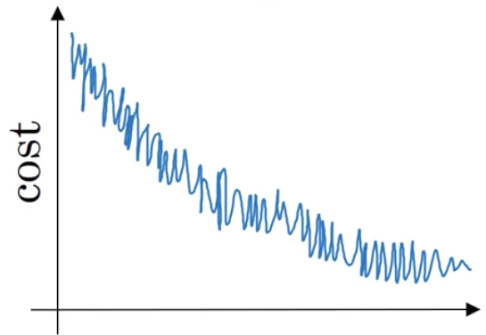
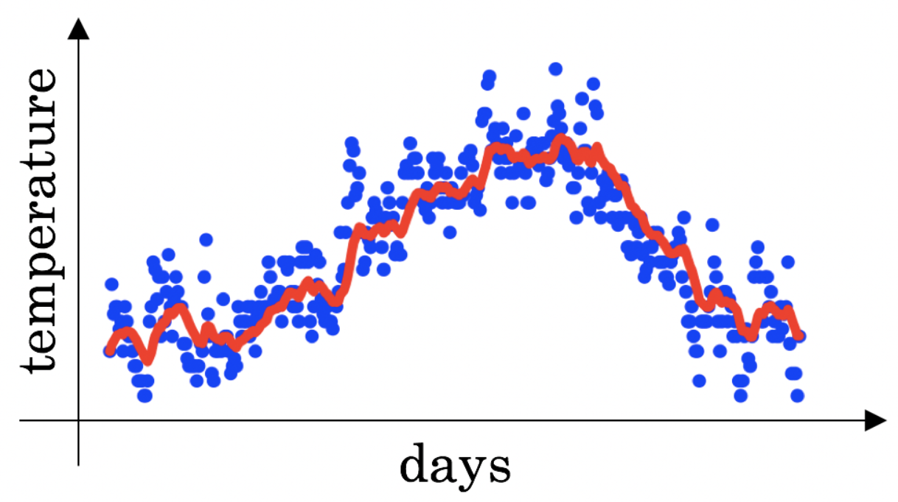

## Week 2 Quiz - Optimization Algorithms

1. Which notation would you use to denote the 3rd layer's activations when the
input is the 7th example from the 8th mini-batch?

    - *a^[3]{8}(7)*

2. Which of these statements about mini-batch gradient descent do you agree
with?

    - [ ] Training one epoch using mini-batch gradient descent is faster than
      training one epoch using gradient descent.
    - [ ] You should implement mini-batch gradient descent without an explicit
      for-loop over different mini-batches, so that the algorithm processes all
      mini-batches at the same time (vectorization).
    - [x] One iteration of mini-batch gradient descent is faster than one
      iteration of batch gradient descent.

3. Why is the best mini-batch size usually not 1 and not *m*, but instead
something in between?

    - [x] If the mini-batch size is 1, you lose the benefits of vectorization
      across examples of the mini-batch.
    - [x] If the mini-batch size is *m*, you end up with batch gradient descent,
      which has to process the whole training set before it can make progress.
    - [ ] If the mini-batch size is 1, you end up having to process the entire
      training set before making any progress.
    - [ ] If the mini-batch size is *m*, you end up with stochastic gradient
      descent, which is usually slower than mini-batch gradient descent.

4. Suppose your learning algorithm's cost *J*, plotted as a function of the
number of iterations, looks like this:

    

    Which of the following do you agree with?

    - If you're using mini-batch gradient descent, this looks acceptable.
      But if you're using batch gradient descent, something is wrong.

5. Suppose the temperature in Casablanca over the first three days of January
   are the same:

    Jan 1st: *\theta_1 = 10 C*
    Jan 2nd: *\theta_2 = 10 C*

    Say you use an exponentially weighted average with *\beta = 0.5* to track
    temperature: *v_0 = 0, v_t = \beta v_(t-1) + (1 - \beta)\theta_t*. If *v_2*
    is the value computed after day 2 without bias correction, and
    *v^(corrected)_2* is the value you compute with bias correction. What are
    these values?

    - *v_2 = 7.5, v^(corrected)_2 = 10*.

6. Which of these is NOT a good learning rate decay scheme? Here, *t* is the
epoch number.

    - *\alpha = e^t \alpha_0*.

7. You use an exponentially weighted average on the London temperature dataset.
You use the following to track the temperature: *v_t = \beta v_(t - 1) + (1 -
\beta)\theta_t*. The red line below was computed using *\beta = 0.9*. What
would happen to your red curve as you vary *\beta*?

    

    - [ ] Decreasing *\beta* will shift the red line slightly to the right.
    - [x] Increasing *\beta* will shift the red line slightly to the right.
    - [x] Decreasing *\beta* will create more oscillation within the red line.
    - [ ] Increasing *\beta* will create more oscillation within the red line.

8. Consider this figure:

    

    These plots were generated with gradient descent; with gradient descent with
    momentum (*\beta = 0.5*) and with gradient descent with momentum (*\beta =
    0.9). Which curve corresponds to which algorithm?

    - (1) is gradient descent. (2) is gradient descent with momentum (small
      *\beta*). (3) is gradient descent with momentum (large *\beta*).

9. Suppose batch gradient descent in a deep network is taking excessively long
to find a value of the parameters that achieves a small value for the cost
function. Which of the following techniques could help find parameter values
that attain a small value for *J*?

    - [x] Try using Adam.
    - [x] Try tuning the learning rate *\alpha*.
    - [ ] Try initializing all weights to zero.
    - [x] Try mini-batch gradient descent.
    - [x] Try better random initialization for the weights.

10. Which of the following statements about Adam is False?

    - [ ] The learning rate *\alpha* in Adam usually needs to be tuned.
    - [x] Adam should be used with batch gradient computations, not with
      mini-batches.
    - [ ] We usually use default values for the hyperparameters *\beta_1,
      \beta_2, \epsilon* in Adam.
    - [ ] Adam combines the advantages of RMSprop and momentum.

