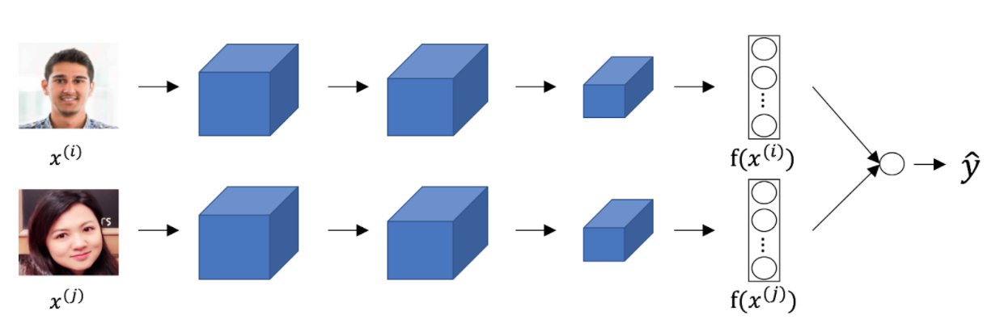

## Week 4 Quiz - Special Applications: Face Recognition & Neural Style Trasnfer

1. Face verification requires comparing a new picture against one person's face,
whereas face recognition requires comparing a new picture against K person's
faces.

    - [x] True.
    - [ ] False.

2. Why do we learn a function *d(img1, img2)* for face verification?

    - [x] This allows us to recognize a new person given just a single image of
      that person.
    - [x] We need to solve a one-shot learning problem.
    - [ ] Given how few images we have per person, we need to apply transfer
      learning.
    - [ ] This allows us to learn to predict a person's identify using a softmax
      output unit, where the number of classes equals the number of persons in
      the database plus 1 (for the final "not in database" class).

3. In order to train the parameters of a face recognition system, it would be
reasonable to use a training set comprising 100,000 pictures of 100,000
different persons.

    - [ ] True.
    - [x] False.

4. Which of the following is a correct definition of the triplet loss? Consider
*/alpha < 0*.

    - *max(||f(A) - f(P)||^2 - ||f(A) - f(N)||^2 + /alpha, 0)*.

5. Consider the following Simese network architecture:

    

    The upper and lower neural network have different input images, but have
    exactly the same parameters.

    - [x] True.
    - [ ] False.

6. You train a ConvNet on a dataset with 100 different classes. You wonder if
you can find a hidden unit which responds strongly to pictures of cats. You are
more likely to find this unit in layer 4 of the network than in layer 1.

    - [x] True.
    - [ ] False.

7. Neural style transfer is trained as a supervised learning task in which the
goal is to input two images, and train a network to output a new, synthesized
image.

    - [ ] True.
    - [x] False.

8. In the deeper layers of a ConvNet, each channel corresponds to a different
feature detector. The style matrix *G^[l]* measures the degree to which the
activations of different feature detectors in layer *l* vary (or correlate)
together with each other.

    - [x] True.
    - [ ] False.

9. In neural style transfer, what is updated in each iteration of the
optimization algorithm?

    - [ ] The regularization parameters.
    - [x] The pixel values of the generated image *G*.
    - [ ] The pixel values of the content image *C*.
    - [ ] The neural network parameters.

10. You are working with 3D data. You are building a network layer whose input
volume has size 32x32x32x16, and applies convolutions with 32 filters of
dimension 3x3x3 (no padding, stride 1). What is the resulting output volume?

    - [ ] Undefined: this convolution step is impossible and cannot be performed
      because the dimensions specified don't match up.
    - [ ] 30x30x30x16.
    - [x] 30x30x30x32.

