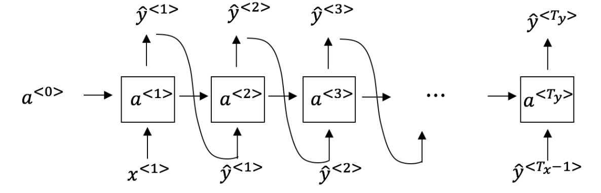
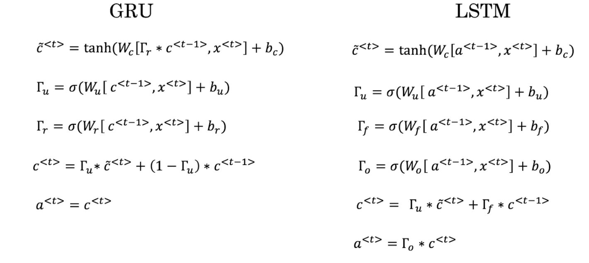

## Week 1 Quiz - Recurrent Neural Networks

1. Suppose your training examples are sentences (sequences of words). Which of
the following refers to the *j^th* word in the *i^th* training example?

    - *x^(i)<j>*.

2. Consider this RNN:

    

    This specific type of architecture is appropriate when:

    - *T_x = T_y*.

3. To which of these tasks would you apply a many-to-one RNN architecture?

    

    - [ ] Speech recognition (input an audio clip and output a transcript).
    - [x] Sentiment classification (input a piece of text and output a 0/1 to
      denote positive or negative sentiment).
    - [ ] Image classification.
    - [x] Gender recognition from speech (input an audio clip and output a label
      indicating the speaker's gender).

4. You are training this RNN language model.

    

    At the *t^th* time step, what is the RNN doing?

    - Estimating *P(y^<t> | y^<1>, y^<2>, ..., y^<t-1>)*.

5. You have finished training a language model RNN and are using it to sample
random sentences, as follows:

    

    What are you doing at each time step *t*?

    - (i) Use the probabilities output by the RNN to randomly sample a chosen
      word for that time-step as *y_hat^<t>*. (ii) Then pass this selected word
      to the next time-step.

6. You are training a RNN, and find that your weights and activations are all
taking on the value of *NaN*. Which of these is the most likely cause of this
problem?

    - Exploding gradient problem.

7. Suppose you are training a LSTM. You have a 10,000 word vocabulary, and are
using a LSTM with 100-dimensional activations *a^<t>*. What is the dimension of
*/Gamma_u* at each time step?

    - 100.

8. Here're the update equations for the GRU.

    

    Alice proposes to simplify the GRU by always removing the */Gamma_u*, i.e.
    setting */Gamma_u = 1*. Betty proposes to simplify the GRU by removing the
    */Gamma_r*, i.e. setting */Gamma_r = 1* always. Which of these models is more
    likely to work without vanishing gradient problems even when trained on very
    long input sequences?

    - Betty's model (removing */Gamma_r*), because if */Gamma_u /approx 0* for a
      timestep, the gradient can propagate through that timestep without much
      decay.

9. Here are the equations for the GRU and LSTM:

    

    From these, we can see that the Update Gate and Forget Gate in the LSTM play
    a role similar to *x* and *y* in the GRU.

        - */Gamma_u* and *(1 - /Gamma_u)*.

10. You have a pet dog whose mood is heavily dependent on the current and past
few day's weather. You've collected data for the past 365 days on the weather,
which you represent as *x^<1>, ..., x^<365>*. You've also collected data on your
dog's mood, which you represent as *y^<1>, ..., y^<365>*. You'd like to build
a model to map *x --> y*. Should you use a Unidirectional RNN or a Bidirectional
RNN for this problem?

    - Unidirectional RNN, because the value of *y^<t>* depends only on *x^<1>,
      ..., x^<t>*, but not on *x^<t+1>, ..., x^<365>*.
