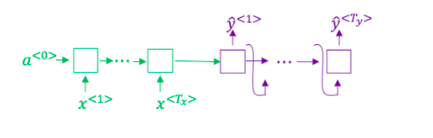
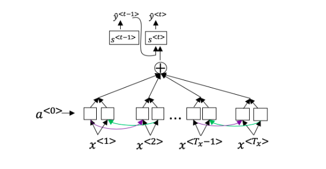
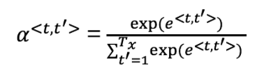

## Week 3 Quiz - Sequence Models & Attention Mechanism

1. Consider using this encoder-decoder model for machine-translation:

    

    This model is a "conditional language model" in the sense that the encoder
    portion is modeling the probability of the input sentence *x*.

    - [ ] True.
    - [x] False.

2. In beam search, if you increase the beam width *B*, which of the following
would you expect to be true?

    - [x] Beam search will run more slowly.
    - [x] Beam search will use more memory.
    - [x] Beam search will generally find better solutions.
    - [ ] Beam search will converge after fewer steps.

3. In machine translation, if we carry out beam search without using sentence
normalization, the algorithm will tend to output overly short translations.

    - [x] True.
    - [ ] False.

4. Suppose you are building a speech recognition system, which uses an RNN model
to map from audio clip *x* to a text transcript *y*. Your algorithm uses beam
search to try to find the value of y that maximizes *P(y|x)*.

    On a dev set example, given an input audio clip, your algorithm outputs the
    transcript *y^hat = "In building a A Eye system in Silly con Valley."*,
    whereas a human gives a much superior transcript *y^star = "I'm building an
    AI system in Sillicon Valley."*.

    According to your model,

    - *P(y^hat|x) = 1.09e-7*
    - *P(y^star|x) = 7.21e-8*

    Would you expect increasing the beam width *B* to help correct this example?

    - No, because *P(y^star|x) <= P(y^hat|x)* indicates the error should be
      attributed to the RNN rather than to the search algorithm.

5. Continuing the example from Q4, suppose you work on your algorithm for a few
more weeks, and now find that for the vast majority of examples on which your
algorithm makes a mistake, *P(y^star|x) >= P(y^hat|x)*. This suggests you should
focus your attention on improving the search algorithm.

    - [x] True.
    - [ ] False.

6. Consider the attention model for machine translation:

    

    Further, here is the formula for */alpha^<t,t'>*:

    

    Which of the following statements about */alpha^<t,t'>* are true?

    - [x] We expect */alpha^<t,t'>* to be generally larger for values of
      *a^<t'>* that are highly relevant to the value the network should output
      for *y^<t>*.
    - [ ] We expect */alpha^<t,t'>* to be generally larger for values of
      *a^<t>* that are highly relevant to the value the network should output
      for *y^<t'>*.
    - [ ] */sum_t /alpha^<t,t'> = 1*.
    - [x] */sum_t' /alpha^<t,t'> = 1*.

7. The network learns where to pay attention by learning the values *e^<t,t'>*,
which are computed using a small neural network. We can't replace *s^<t-1>* with
*s^<t>* as an input to this neural network, because *s^<t>* depends on
*/alpha^<t,t'>* which in turn depends on *e^<t,t'>*; so at the time we need to
evaluate this network, we haven't computed *s^<t>* yet.

    - [x] True.
    - [ ] False.

8. Compared to the encoder-decoder model shown in Q1, we expect the attention
model to have the gratest advantage when:

    - The input sequence length *T_x* is large.

9. Under the CTC model, identical repeated characters not separated by the
"blank" character (\_) are collapsed. Under the CTC what does the following
string collapse to?

    \_\_c\_oo\_o\_kk\_\_\_b\_ooooo\_\_oo\_\_kkk

    - cookbook

10. In the trigger word detection, *x^<t>* is:

    - [x] Features of the audio (such as spectogram features) at time *t*.
    - [ ] The *t*-th input word, represented as either a one-hot vector or a
      word embedding.
    - [ ] Wether the trigger word is being said at time *t*.
    - [ ] Wether someone has just finished saying the trigger word at time *t*.

